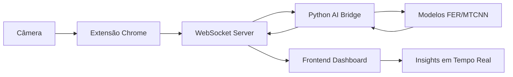

# 🚀 Hackathon Qualcomm - Edge AI

# 🎯 SalesFlow AI (InsightFlow)

> **Uma solução de IA Edge para otimização de vendas em tempo real, processando análises localmente em dispositivos Snapdragon X Plus.**

## 👥 Grupo 13

## :student: Integrantes: 

- <a href="https://www.linkedin.com/in/eduardo-jesus-2bb399285/">Eduardo Jesus</a>
- <a href="https://www.linkedin.com/in/evertonmdev/">Everton Mendes</a>
- <a href="https://www.linkedin.com/in/kaian-moura-56b8871b4">Kaian Moura</a> 
- <a href="https://www.linkedin.com/in/marcos-vinicios-02174b24b/?utm_source=share&utm_campaign=share_via&utm_content=profile&utm_medium=ios_app">Marcos Vinicios</a> 
- <a href="https://www.linkedin.com/in/reimar-filho/">Reimar Filho</a>
- <a href="https://www.linkedin.com/in/victorbarq/">Breno</a>

## 🎥 Demonstração

<b>Link para vídeo demonstrativo:</b> <a href="">Em produção</a>

## 📖 Descrição do Projeto

O **SalesFlow AI** é uma aplicação inovadora de Edge AI que revoluciona o processo de vendas através de análise inteligente em tempo real. Utilizando o poder de processamento local dos dispositivos Snapdragon X Plus, nossa solução oferece:

### 🎯 **Principais Funcionalidades**

- **🎤 Monitoramento do Funil de Vendas**: Alertas em tempo real quando etapas cruciais são perdidas
- **😊 Análise de Emoções**: Detecção de expressões faciais e tom de voz para identificar momentos críticos
- **💡 Insights Acionáveis**: Sugestões inteligentes baseadas em análise de padrões de vendas
- **📊 Relatórios Pós-Reunião**: Análise completa com marcos temporais e pontos de melhoria
- **🔒 IA Edge Local**: Processamento 100% local, garantindo privacidade total
- **⚡ Resposta Instantânea**: Feedback em tempo real durante reuniões

### 🛠️ **Tecnologias Utilizadas**

#### **Frontend**
- **React + TypeScript + Vite + Tailwind CSS**
- **UI Components**: Radix UI para componentes acessíveis
- **Build Tool**: Vite para desenvolvimento rápido

#### **Backend & IA**
- **Runtime**: Bun/Node.js com TypeScript
- **WebSocket**: Comunicação em tempo real
- **Python Bridge**: Integração com modelos de IA
- **Detecção de Emoções**: FER (Facial Expression Recognition) + TensorFlow
- **Processamento de Imagem**: OpenCV + Pillow
- **Análise Facial**: MTCNN para detecção de faces

#### **Edge AI & Modelos**
- **FER**: Reconhecimento de expressões faciais
- **TensorFlow**: Framework de machine learning otimizado
- **MTCNN**: Multi-task Cascaded Convolutional Networks
- **Face-API.js**: Biblioteca JavaScript para detecção facial
- **Processamento Local**: Otimizado para Snapdragon X Plus NPU

## 📁 Estrutura do Projeto

```text
Edge-Ai-Qualcomm-Grupo13/
├── 📄 index.html              # Landing page do projeto
├── 📄 README.md               # Documentação principal
├── 📁 frontend/               # Aplicação React do dashboard
│   ├── 📄 package.json        # Dependências do frontend
│   ├── 📄 vite.config.ts      # Configuração do Vite
│   └── 📁 src/
│       ├── 📄 App.tsx         # Componente principal
│       ├── 📄 main.tsx        # Ponto de entrada
│       ├── 📁 components/     # Componentes React
│       │   ├── HUDPage.tsx
│       │   ├── MeetingList.tsx
│       │   ├── RecentInsights.tsx
│       │   └── 📁 ui/         # Componentes UI reutilizáveis
│       ├── 📁 guidelines/     # Diretrizes do projeto
│       └── 📁 styles/         # Estilos globais
└── 📁 backend/                # Backend de IA e análise
    ├── 📄 package.json        # Dependências Node.js/Bun
    ├── 📄 requirements.txt    # Dependências Python
    ├── 📄 index.ts            # Servidor WebSocket principal
    ├── 📄 emotion_detector.py # Detector de emoções em Python
    ├── 📁 src/
    │   ├── 📁 modules/        # Módulos de IA
    │   │   └── IndentifyFaceExpression.ts
    │   ├── 📁 models/         # Modelos de machine learning
    │   └── 📁 controller/     # Controladores de API
    └── 📁 browser_extension/  # Extensão do Chrome
        ├── 📄 manifest.json   # Configuração da extensão
        ├── 📄 background.js   # Service worker
        ├── 📄 popup.html      # Interface da extensão
        └── 📄 offscreen.js    # Captura de vídeo
```

### 🔧 Componentes Principais

#### **Frontend Dashboard**
- **Interface responsiva** construída com React + TypeScript
- **Sistema de componentes** baseado em Radix UI para máxima acessibilidade
- **Gerenciamento de estado** para reuniões e insights
- **Visualizações em tempo real** de dados de emoções

#### **Backend de IA**
- **Servidor WebSocket** (TypeScript) para comunicação em tempo real
- **Python Bridge** para integração com modelos de detecção de emoções
- **Processamento de imagens** com OpenCV e TensorFlow
- **API REST** para gerenciamento de sessões e relatórios

#### **Modelos de IA Edge**
- **FER (Facial Expression Recognition)** para detecção de 7 emoções básicas
- **MTCNN** para detecção robusta de faces em tempo real
- **Face-API.js** para processamento otimizado no navegador
- **TensorFlow.js** otimizado para Snapdragon X Plus NPU

#### **Extensão do Navegador**
- **Captura de vídeo** em tempo real durante reuniões
- **Análise discreta** sem interferir na experiência do usuário
- **Compatibilidade** com Google Meet, Zoom, Teams
- **Interface minimalista** para controle e status

## 💻 Configuração e Execução

### 📋 Pré-requisitos

- **Node.js** 18+
- **Python** 3.8+
- **Bun** (opcional, pode usar npm)
- **Git**
- **Dispositivo compatível** com Snapdragon X Plus (recomendado)

### 🚀 Instalação

1. **Clone o repositório**:

   ```bash
   git clone https://github.com/Reimar-Coelho/Edge-Ai-Qualcomm-Grupo13.git
   cd Edge-Ai-Qualcomm-Grupo13
   ```

2. **Configure o Frontend**:

   ```bash
   cd frontend
   npm install
   ```

3. **Configure o Backend**:

   ```bash
   cd ../backend
   
   # Instalar dependências Node.js/Bun
   bun install
   # ou: npm install
   
   # Instalar dependências Python
   pip install -r requirements.txt
   # ou: python -m pip install -r requirements.txt
   ```

4. **Execute o projeto**:

   **Terminal 1 - Backend:**
   ```bash
   cd backend
   bun run index.ts
   # ou: npm run dev
   ```

   **Terminal 2 - Frontend:**
   ```bash
   cd frontend
   npm run dev
   ```

5. **Instale a Extensão do Chrome** (opcional):
   - Abra `chrome://extensions/`
   - Ative "Modo desenvolvedor"
   - Clique em "Carregar extensão sem compactação"
   - Selecione a pasta `backend/browser_extension`

6. **Acesse a aplicação**:
   - Dashboard: `http://localhost:5173`
   - Backend WebSocket: `ws://localhost:8080`
   - Landing Page: Abra `index.html` no navegador

### 🖥️ Execução em Diferentes Ambientes

#### **Desenvolvimento Local**
```bash
cd frontend
npm run dev
```

#### **Produção**
```bash
cd frontend
npm run build
# Os arquivos estarão na pasta dist/
```

### ⚙️ Configuração da IA Edge

O sistema foi otimizado para rodar em dispositivos **Snapdragon X Plus**, aproveitando:
- **NPU (Neural Processing Unit)** para aceleração de IA
- **Processamento local** sem dependência de nuvem
- **Baixa latência** para análise em tempo real

## 🎯 Como Usar

### 🖥️ **Modo Dashboard (Desenvolvimento)**
1. **Inicie o backend** (`bun run index.ts` na pasta backend)
2. **Inicie o frontend** (`npm run dev` na pasta frontend)
3. **Acesse o dashboard** em `http://localhost:5173`
4. **Configure uma reunião** através da interface

### 🌐 **Modo Extensão (Produção)**
1. **Instale a extensão** no Chrome conforme instruções acima
2. **Entre em uma reunião** (Google Meet, Zoom, Teams)
3. **Ative a extensão** clicando no ícone
4. **Receba insights** em tempo real durante a conversa

### 📊 **Fluxo de Análise**
1. **Captura de vídeo** → A extensão/interface captura frames da câmera
2. **Detecção de faces** → MTCNN identifica rostos na imagem
3. **Análise de emoções** → FER classifica expressões faciais
4. **Processamento local** → Tudo roda no dispositivo Snapdragon X Plus
5. **Insights em tempo real** → Dashboard mostra resultados instantaneamente
6. **Relatórios pós-reunião** → Análise completa com marcos temporais

### 🔧 **APIs Disponíveis**

#### **WebSocket** (`ws://localhost:8080`)
```json
// Enviar frame para análise
{
  "command": "analyze_frame",
  "image": "data:image/jpeg;base64,..."
}

// Resposta com emoções detectadas
{
  "faces": 2,
  "results": [
    {
      "face": 1,
      "emotion": "happy",
      "confidence": 0.89
    }
  ]
}
```

## �️ Arquitetura do Backend

### 🔧 **Componentes Principais**

#### **🌐 Servidor WebSocket (TypeScript)**
- **Comunicação em tempo real** entre frontend e modelos de IA
- **Processamento de frames** de vídeo em alta performance
- **Gestão de sessões** de múltiplos usuários simultaneamente

#### **🐍 Python AI Bridge**
- **Interface de comunicação** entre Node.js/Bun e modelos Python
- **Processamento de imagens** com OpenCV e Pillow
- **Detecção de emoções** usando FER e TensorFlow
- **Otimização de memória** para processamento contínuo

#### **🧠 Modelos de IA**
- **FER (Facial Expression Recognition)**: 7 emoções básicas
  - `angry`, `disgust`, `fear`, `happy`, `sad`, `surprise`, `neutral`
- **MTCNN**: Detecção robusta de múltiplas faces
- **TensorFlow**: Backend otimizado para Snapdragon X Plus
- **Face-API.js**: Processamento alternativo no navegador

#### **🔌 Extensão do Chrome**
- **Service Worker**: Captura discreta de vídeo
- **Offscreen Processing**: Análise sem interferir na UI
- **Content Scripts**: Integração com plataformas de videoconferência
- **Background Processing**: Envio contínuo para servidor

### 📊 **Fluxo de Dados**



### ⚡ **Performance e Otimizações**

- **Edge Computing**: 100% processamento local
- **Baixa Latência**: < 200ms por frame analisado
- **Snapdragon X Plus NPU**: Aceleração dedicada para IA
- **Memory Pooling**: Reutilização eficiente de recursos
- **Frame Throttling**: Análise inteligente baseada em mudanças

## �🏆 Diferenciais da Solução

- ✅ **100% Edge Computing**: Processamento local sem envio de dados
- ✅ **Tempo Real**: Análise instantânea durante reuniões
- ✅ **Privacidade Total**: Dados nunca saem do dispositivo
- ✅ **Interface Intuitiva**: Dashboard moderno e responsivo
- ✅ **Otimizado Snapdragon**: Aproveitamento máximo do hardware

## 📊 Resultados Esperados

- **35% aumento** na taxa de fechamento de vendas
- **50% redução** no tempo de treinamento de novos vendedores
- **Melhoria significativa** na estruturação de negociações

## 🤝 Contribuindo

Contributions são bem-vindas! Por favor:

1. Faça um fork do projeto
2. Crie uma branch para sua feature (`git checkout -b feature/AmazingFeature`)
3. Commit suas mudanças (`git commit -m 'Add some AmazingFeature'`)
4. Push para a branch (`git push origin feature/AmazingFeature`)
5. Abra um Pull Request

## 📄 Licença


<a href="https://github.com/Reimar-Coelho/Edge-Ai-Qualcomm-Grupo13/">InsightFlow</a> © 2025 by <a href="https://creativecommons.org">Reimar Coelho, Kaian Moura, Eduardo Jesus, Everton Matheus, Breno Maia e Marcos Vinicios</a> is licensed under <a href="https://creativecommons.org/licenses/by/4.0/">CC BY 4.0</a>


---

<div align="center">

**Desenvolvido com ❤️ pelo Grupo 13 para o Hackathon Qualcomm Edge AI**

[🌟 Deixe uma estrela](https://github.com/Reimar-Coelho/Edge-Ai-Qualcomm-Grupo13) | [📋 Reporte um bug](https://github.com/Reimar-Coelho/Edge-Ai-Qualcomm-Grupo13/issues) | [💡 Sugestões](https://github.com/Reimar-Coelho/Edge-Ai-Qualcomm-Grupo13/discussions)

</div>