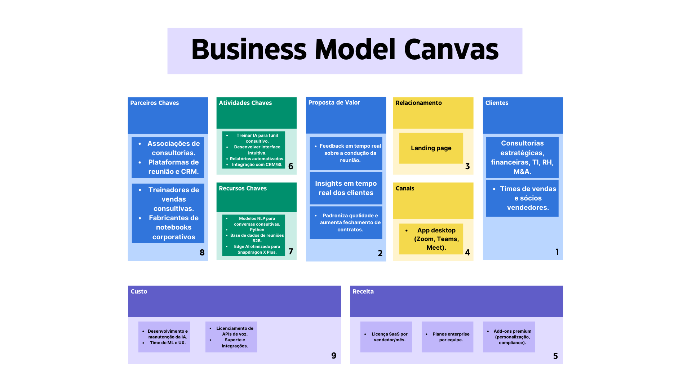

# Edge AI - Hackathon Qualcomm

Este diretório contém a documentação do projeto desenvolvido para o Hackathon Qualcomm, incluindo requisitos, atas de reunião, atas de decisões técnicas, e outros documentos relevantes.

## Business Model Canva

# 🧠 AI Coach para Consultorias – Business Model Canvas  

---

## 📑 Explicação Breve  

Este projeto apresenta uma solução de **AI analyst para equipes de vendas de consultorias**, com foco em aumentar a eficácia nas reuniões com clientes.  

A proposta central é fornecer **feedback em tempo real** sobre a condução da reunião e **insights pós-reunião**, garantindo que toda reunião seja feita de maneira ideal e completa.  

A solução roda em **Edge AI (Snapdragon X Plus)**, permitindo análise rápida, segura e sem depender de cloud durante a reunião. Isso assegura **privacidade dos dados** e maior **eficiência de processamento**.  

---

---

## 📊 Business Model Canvas – Consultorias  

### 1. Proposta de Valor  
- Feedback em tempo real sobre a condução da reunião.  
- Indica etapas do funil não abordadas.  
- Relatório pós-reunião com insights e próximos passos.  
- Padroniza qualidade e aumenta fechamento de contratos.  

### 2. Segmentos de Clientes  
- Consultorias estratégicas, financeiras, TI, RH, M&A.  
- Times de vendas e sócios vendedores.  

### 3. Canais  
- App desktop (Zoom, Teams, Meet).  
- Integração com CRMs (HubSpot, Pipedrive, Salesforce).  
- Relatórios por e-mail/dashboards.  

### 4. Relacionamento  
- Onboarding e treinamento.  
- Relatórios de performance trimestrais.  
- Customização para cada consultoria.  

### 5. Receita  
- Licença SaaS por vendedor/mês.  
- Planos enterprise por equipe.  
- Add-ons premium (personalização, compliance).  

### 6. Recursos-Chave  
- Modelos NLP para conversas consultivas.  
- Base de dados de reuniões B2B.  
- Edge AI otimizado para Snapdragon X Plus.  

### 7. Atividades-Chave  
- Treinar IA para funil consultivo.  
- Desenvolver interface intuitiva.  
- Relatórios automatizados.  
- Integração com CRM/BI.  

### 8. Parcerias  
- Associações de consultorias.  
- Plataformas de reunião e CRM.  
- Treinadores de vendas consultivas.  
- Fabricantes de notebooks corporativos.  

### 9. Custos  
- Desenvolvimento e manutenção da IA.  
- Time de ML e UX.  
- Licenciamento de APIs de voz.  
- Suporte e integrações.  

---

## 🖼️ Espaço para Imagem  

  
